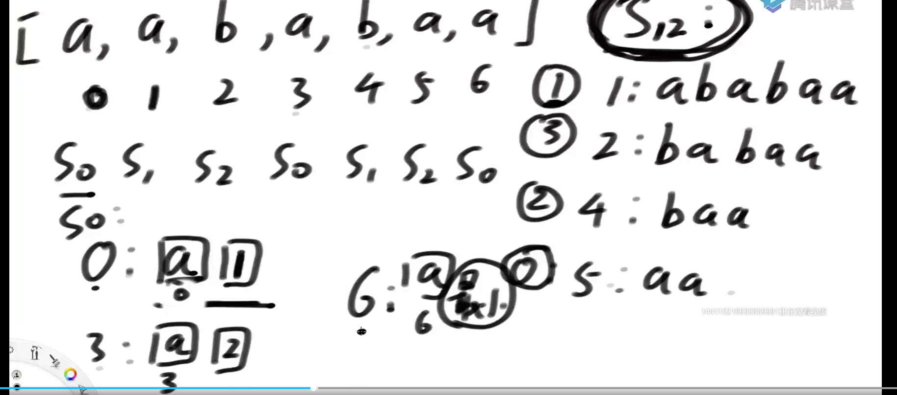
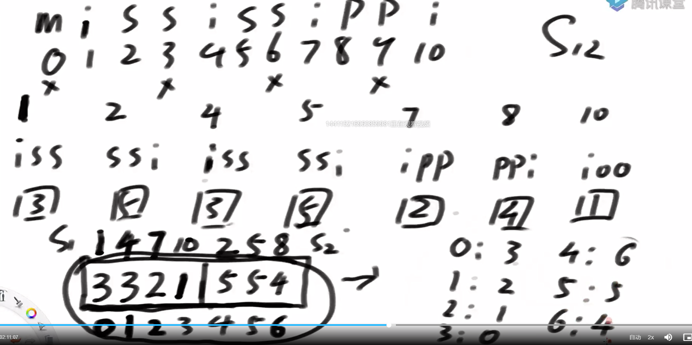
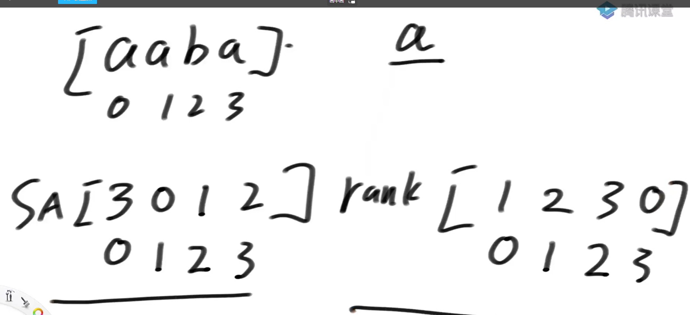
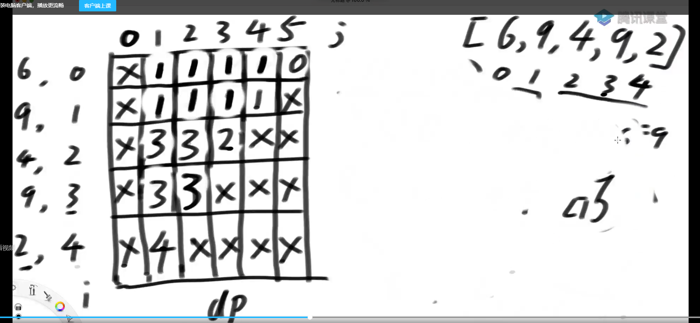

# DC3算法

所有后缀字符串的字典序排名记录在一个数组里面
[a a b a c b a]
所有后缀字符串为：

0：aabacba

1：abacba

2：bacba

3：acba

4：cba

5：ba

6：a

--> 生成的后缀数组为:
[1 2 5 3 6 4 0]
--> rank数组（按后缀的字典序排序）:
[6 0 1 3 5 2 4]
i位置的排名记录在rank数组

暴力方法生成排名数组

1. 生成后缀串是 `O(N^2)`代价
2. 比较两个字符串的字典序 ，需要`O(N*logN)`代价，还需要`O(N)`比较代价

所以，暴力解法的总时间复杂度是：`O(N^2*logN)`

DC3算法可以做到`O(N)`

数组(每个元素有三维数据)要求排序怎么最快，

排序规则是：第一维小的排前，第一维相等的情况下，第二维小的排前面，第二维相等的情况下，第三维小的排前面

基数排序最快

那么我们可以得到一个结论：**不超过3个维度，每个维度的值范围不大，可以`O(N)`的方式实现排序**

后缀数组不局限于字符串，字符串可以看成是每个字符对应ASCII码的整型数组。

每个位置对应下标

DC3 Skew算法

倍增算法

DC3算法

i % 3 == 0  0类下标

i % 3 == 1  1类下标

i % 3 == 2  2类下标

假设1和2类下标都可以很方便求出来,怎么得到0类的排名

见

首位置不一样，可以用基数排序求出来，首位置一样，只需要考虑下一位以后即可

s0内和s12内用merge策略来排序（最多只需要比三个位置）

第一步：f函数，得到s12内部的排名

第二步：s12内部的排名->s0内部的排名 （基数排序 O(N))

第三步：s12和s0进行merge O(N)

Mississippi

申请一个新的数组

左边s1右边放s2，递归调用DC3算法，得到排名就是对应原数组s1和s2排名

见

代码：Code_0097_DC3.java

关于SA数组和rank数组的说明见下图

高度数组 height[i] 表示 SA[i] 和 SA[i-1] 的最长公共前缀的长度

### 题目1

<https://leetcode.com/problems/last-substring-in-lexicographical-order/>

## 题目2

Leetcode Create Maximum number
arr1 arr2 各挑选部分 merge求值
f(arr, p)  arr中求p个大小的最好结果

见

merge
f(arr, p) merge f(arr2, k - p)

考虑base case

merge过程用后缀数组排名方式来做

## 题目3

> 给定两个字符串str1和str2，想把str2整体插入到str1中的某个位置,形成最大的字典序,返回字典序最大的结果

最优解 `O(N+M) + O(M^2)`

如果str1从0开始的后缀串大于str2的字典序，则说明str2没有必要插在str1的0位置之前。

## 题目4

> 最长公共子串的最优解
